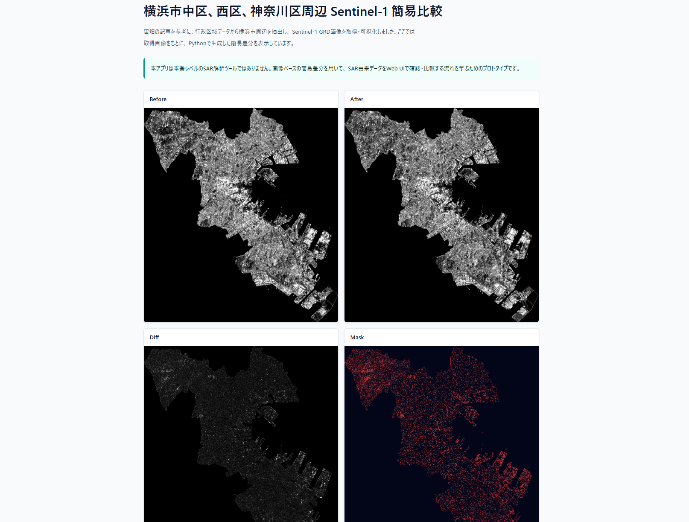

# SAR Change Review Workbench

Sentinel-1 GRD画像を題材に、SAR画像の取得・可視化からWebアプリケーション上での比較・確認・判断までの流れを学ぶためのReact / TypeScript製Webアプリケーションです。

## 目的

本プロジェクトは、本番レベルのSAR解析やPythonスキルを示すことを目的としたものではありません。

衛星データやSARデータを扱う基本的な流れを学び、自分の強みであるWebアプリケーション開発と接続することを目的に作成しています。

## 学習・実装で参考にした内容

SAR画像の取得・可視化の学習には、宙畑の記事「SAR画像（Sentinel-1）の取得から可視化まで～GEE、STAC編～」を参考にしました。

記事では東京都千代田区の行政区域データを題材にしていますが、本プロジェクトでは横浜市周辺を対象にしました。

行政区域データの読み込み、Shapefileからの対象地域抽出、Google Earth Engineで扱える形式への変換、Sentinel-1 GRD画像の取得・可視化という流れを、Google Colab上で確認しました。

## 方針

- 本アプリは本番レベルのSAR解析ツールではありません。
- 高精度な解析を目的としていません。
- Pythonは、取得済みGeoTIFFの読み込み、Web表示用PNGへの変換、差分画像、変化マスク、簡易メトリクス生成に使用します。
- React / TypeScriptでは、処理結果を比較・確認・判断するためのUIを実装します。
- 現時点では、ColabでのGEE操作やローカルPythonスクリプトの実行は手動です。

## 使用技術

- React
- TypeScript
- Vite
- Tailwind CSS
- Python
- NumPy
- Pillow
- rasterio
- Google Colab
- Google Earth Engine
- geemap

## データ取得・処理の流れ

本プロジェクトでは、以下の流れでSentinel-1画像を取得・処理しました。

1. Google Colabで国土数値情報の行政区域データを読み込む
2. Shapefileから横浜市周辺の行政区域を抽出する
3. geemapを使って行政区域データをGoogle Earth Engineで扱えるGeometry形式へ変換する
4. Google Earth EngineでSentinel-1 GRD画像を検索・取得する
5. 取得したGeoTIFFをローカル環境に配置する
6. PythonスクリプトでWeb表示用PNG、差分画像、変化マスク、簡易メトリクスを生成する
7. React / TypeScriptアプリで処理結果を表示する

## 参考資料

本プロジェクトでは、SAR画像取得・可視化・Web表示までの流れを理解するため、以下の資料を参考にしました。

- [宙畑: SAR画像（Sentinel-1）の取得から可視化まで～GEE、STAC編～](https://sorabatake.jp/40716/)
  - 行政区域データの取得
  - Shapefile / GeoJSONをGEEで扱う流れ
  - Sentinel-1 GRD画像の検索・取得
  - VV偏波画像の可視化

- [Rasterio: Reading Datasets](https://rasterio.readthedocs.io/en/stable/topics/reading.html)
  - GeoTIFFの読み込み
  - `dataset.read(1)` によるバンド読み込み
  - rasterデータをNumPy配列として扱う考え方

- [Pillow: Concepts](https://pillow.readthedocs.io/en/stable/handbook/concepts.html)
  - 画像のmode、band、8bit画像の考え方
  - NumPy配列からPNG画像を書き出す方法

- [NumPy: Data types](https://numpy.org/doc/stable/user/basics.types.html)
  - `ndarray`
  - `uint8`

- [NumPy: numpy.percentile](https://numpy.org/doc/stable/reference/generated/numpy.percentile.html)
  - パーセンタイルを使った表示用の値変換

- [Python: argparse Tutorial](https://docs.python.org/3/howto/argparse.html)
  - `--scene-dir` や `--threshold` のようなコマンドライン引数の扱い

- [Google Python Style Guide: Docstrings](https://google.github.io/styleguide/pyguide.html#383-functions-and-methods)

## セットアップ

```bash
yarn install
yarn dev
```

ビルド確認:

```bash
yarn build
```

## 画面イメージ



## 学習ログ

知識不足、調べた内容、現時点の理解は以下に整理しています。

- [Learning Log](./docs/learning.md)